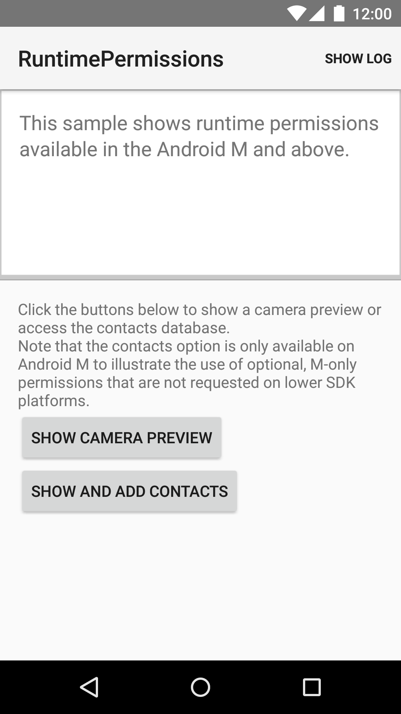

Android RuntimePermissions Sample
===================================

This sample shows runtime permissions available in Android M and above.
It shows how to check and request permissions at runtime, handle backwards compatibility using the
support library and how to declare optional permissions for M-devices only.

Introduction
------------

Android M introduced runtime permissions. Applications targeting M and above need to request their
permissions at runtime.
All permissions still need to be declared in the AndroidManifest. However, when accessing APIs that
require a permission, the Activity or Fragment has to verify that the permission has been granted
or request the missing permissions using calls through the support library. Permissions are checked
through  ActivityCompat#checkSelfPermission(Context, String) or
ContextCompat#checkSelfPermission(Context, String).
Permission are requested through ActivityCompat#requestPermissions(Activity, String[], int), and the response
received in a callback to  ActivityCompat.OnRequestPermissionsResultCallback#onRequestPermissionsResult(int, String[], int[]).
Applications can provide an additional rational for the use of permissions after calling
ActivityCompat#shouldShowRequestPermissionRationale(Activity,String). This call will return true if the
application should provide the user with more context on why the requested permissions is needed,
for example if the permission request has been denied before.

If an application targets an SDK below M, all permissions are granted at runtime and are available
when the application is running. The support library calls handle these checks appropriately.
However, if permissions have been turned off in the system settings
for an application targeting an SDK below M, the API will return empty or no data.

Pre-requisites
--------------

- Android SDK v23
- Android Build Tools v23.0.0
- Android Support Repository

Screenshots
-------------

  

Getting Started
---------------

This sample uses the Gradle build system. To build this project, use the
"gradlew build" command or use "Import Project" in Android Studio.

Support
-------

- Google+ Community: https://plus.google.com/communities/105153134372062985968
- Stack Overflow: http://stackoverflow.com/questions/tagged/android

If you've found an error in this sample, please file an issue:
https://github.com/googlesamples/android-RuntimePermissions

Patches are encouraged, and may be submitted by forking this project and
submitting a pull request through GitHub. Please see CONTRIBUTING.md for more details.

License
-------

Copyright 2014 The Android Open Source Project, Inc.

Licensed to the Apache Software Foundation (ASF) under one or more contributor
license agreements.  See the NOTICE file distributed with this work for
additional information regarding copyright ownership.  The ASF licenses this
file to you under the Apache License, Version 2.0 (the "License"); you may not
use this file except in compliance with the License.  You may obtain a copy of
the License at

http://www.apache.org/licenses/LICENSE-2.0

Unless required by applicable law or agreed to in writing, software
distributed under the License is distributed on an "AS IS" BASIS, WITHOUT
WARRANTIES OR CONDITIONS OF ANY KIND, either express or implied.  See the
License for the specific language governing permissions and limitations under
the License.
